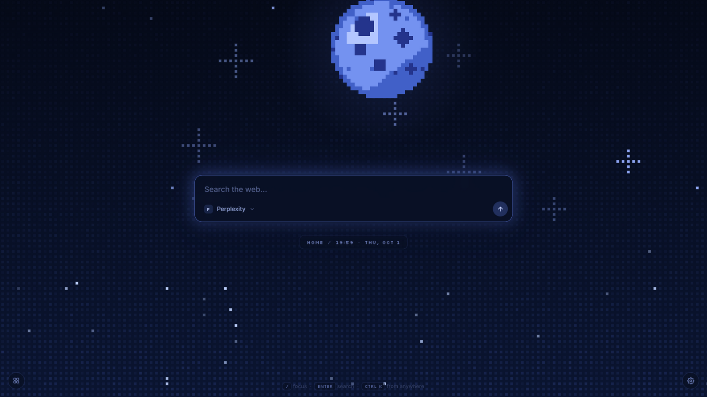
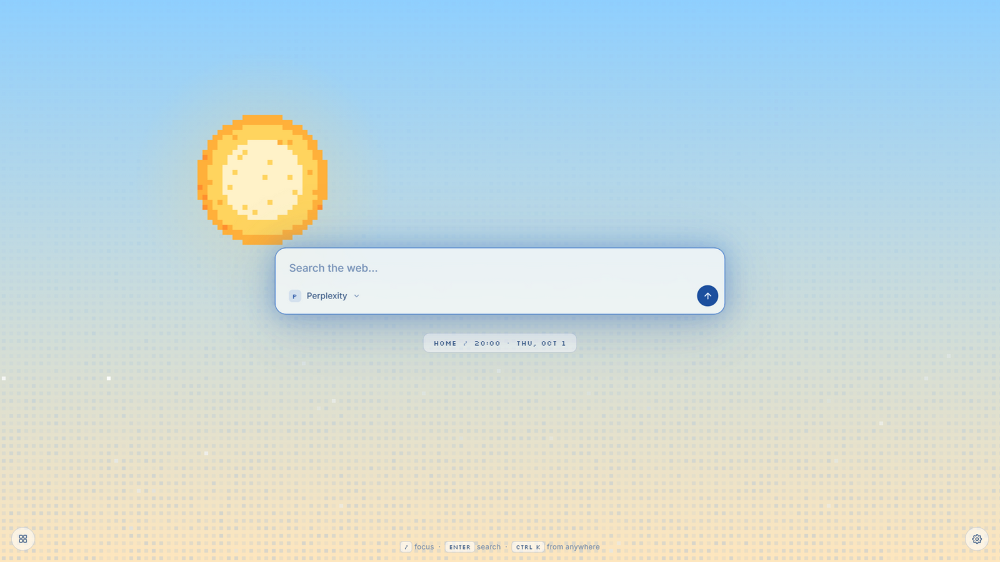
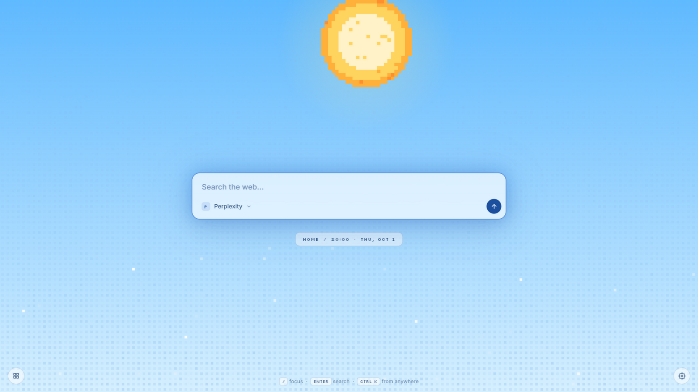
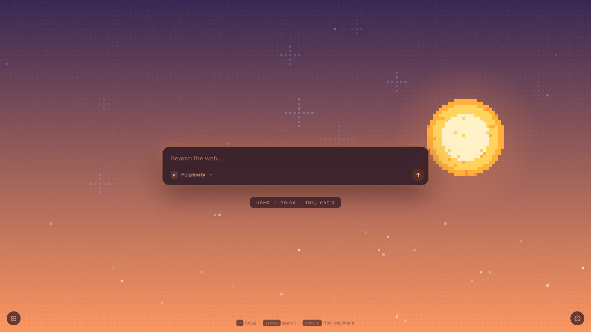

# Home — pixel-art Chrome start page

A minimal pixel-art start page for Chrome, styled after the opencode launcher: a full-screen
**flickering grid** (Velora-style staggered fades), twinkling pixel stars, a pixel sun/moon
that arcs with the clock, and a centered search box with a **provider dropdown**.

**Try it live:** the same page runs in the browser at
[amoralchik.github.io/homepage](https://amoralchik.github.io/homepage/) — no install needed.
Outside the extension the tab strip hides and autocomplete falls back to Google's JSONP
endpoint (see the note below); everything else is identical.

| Night | Morning |
|---|---|
|  |  |
| **Day** | **Evening** |
|  |  |

Providers: **Google · DuckDuckGo · Perplexity**
The choice is remembered (localStorage). `Enter` searches, `/` or `Ctrl+K` focuses the box.
While the search box is empty, the placeholder cycles through hint phrases
(Velora "Vanish Input" style — it hides while you type and stays static under
`prefers-reduced-motion`); the phrases live in the `PLACEHOLDERS` array in `app.js`.

**Autocomplete:** suggestions drop down as you type (2+ characters), Google-style with
keyboard navigation — `↑`/`↓` to pick (the input echoes the highlighted suggestion),
`Enter` to search it, `Esc` to dismiss. Google and DuckDuckGo use their own suggestion
APIs; the other providers fall back to Google's. Requests are debounced, cached, and
aborted when superseded. If remote suggestions are unavailable (offline), typing still
works normally.

**Omnibox behavior:** type something URL-shaped — `github.com`, `example.com/page`,
`localhost:3000` — and a globe row with an `OPEN LINK` tag appears above the suggestions;
`Enter` opens the site directly (`https://` is added for you). Plain text just searches.

**Instant calculator:** type a math expression — `4+4`, `12*7`, `sqrt(16)`, `(2+3)*4`,
`2^10` — and a special card shows the result with a **COPY** tag: `Enter` (or clicking
the card) copies the answer to your clipboard. Suffix `=` is allowed (`4+4=`), as are
`sqrt`, `pi`, `×` and `÷`. Pick a search suggestion instead if you actually wanted to
search the expression.

**Settings:** the gear in the bottom-right corner opens a small panel where you can set
the pill text (anything you like — your name, a project, …) and **freeze** the time of
day to Morning / Day / Evening / Night instead of following the clock. Both are stored
in localStorage; pick **Auto** to return to the real clock.

**Backgrounds:** the **Bg** row in settings switches the whole background style —
**Scene** (the default pixel world), **Aurora** (drifting light blobs), **Grid**
(clean graph paper), **Lamp** (warm light cone), **Noise** (film grain), **Particles**
(floating dust), **Retro** (synthwave perspective floor), **Shooting** (dense
starfield with occasional meteors), **Grain** (vivid gradient with film grain) and
**Halftone** (dot-matrix rendering). Every background is theme- and phase-aware, so
Cyberpunk-Retro or Rose-Aurora look exactly like you'd hope.

**Wallpaper:** the **Wall** row lets you pick an image (stored locally in
IndexedDB, never synced anywhere) and **Halftone** renders it as glowing
dot-matrix art — bright areas become big glowing dots, dark areas fall silent.

**Celestial themes:** in the same panel, pick a planet personality — Classic, Dark,
Bright, **Cyberpunk**, Violet, Red (Mars), Green, Blue or Rose. The theme recolors the
pixel planet/sun, its glow, **the whole sky, grid and stars**, and the UI accents; the
day/night cycle keeps running on top.

**Show/hide:** the **Show** row toggles individual elements — the planet, the stars,
the search input, the time pill, the help dock, and the **pulsing border** on the
search box — for a completely custom minimal (or maximal) layout. Toggles persist
like everything else.

**Tab strip:** the **Tabs** row pins a line of tabs to the middle top of the page.
**Recent** lists the tabs you had open last (across all windows) — clicking one
focuses that exact tab; **Most used** lists your top sites, ranked by a tiny
background tracker that counts tab activations and page loads. Clicking a most-used
site focuses its tab if it's open right now, otherwise opens it in place. Both modes
stay live (the strip refreshes every few seconds) and fall back to letter chips when
a favicon is missing. Outside the extension the strip is unavailable and the row
disappears.

**Widget layer:** press `W` (or the grid button in the bottom-left corner) to toggle a
mod-like layer docked above the button — a HUD that hosts small persistent widgets.
It ships with a **Bus tracker** (live countdowns, simulated feed) and **Good vibes**
(random little reminders — "be happy", "remember i love you", "stay safe" — that float
across the screen every so often; click the card for a new one). The layer remembers
which widgets you added across sessions. New widgets are one registry entry away — see
the `WIDGETS` object in `app.js`.

**Day/night cycle:** the whole page follows the local clock — sunny warm **morning**
(06–11), clear blue **day** (11–17), dusky orange **evening** (17–21), and the starry
**night** (21–06) with the moon. The sun and moon both travel **left → right** across
the sky with the clock (sun 06–21, moon 21–06, arcing high at mid-phase); the UI colors
(panel, text, logo) adapt per phase, and palettes blend near phase boundaries. Phases
re-evaluate every 30 seconds, so a tab left open rolls over on its own. Preview a phase
anytime with `?phase=morning` / `day` / `evening` / `night` in the URL (or set
`CONFIG.forcePhase` in `app.js`).

## Files

| File           | Purpose                                          |
|----------------|--------------------------------------------------|
| `index.html`   | Page markup                                      |
| `style.css`    | Layout, search box, dropdown, pill, hints        |
| `app.js`       | Flickering-grid canvas, sun/moon, search logic   |
| `background.js` | Counts tab/site usage for the "Most used" strip |
| `manifest.json` | Makes the folder a load-unpacked Chrome extension |
| `serve.py`     | Optional dev preview server (no-cache headers)   |

## Install as the New Tab page (recommended)

1. Open `chrome://extensions`
2. Turn on **Developer mode** (top right)
3. Click **Load unpacked** and select this folder
4. Open a new tab — done.

The extension asks for the `tabs` and `storage` permissions — `tabs` is what lets the
tab strip list (Chrome shows this as "Read your browsing activity"); the data never
leaves your machine.

## Or set it as the Home / startup page

- **Home button:** `chrome://settings/appearance` → enable *Show home button* →
  enter the `file:///` URL of `index.html` on your machine
- **On startup:** `chrome://settings/onStartup` → *Open a specific page* → add the same `file:///` URL.

Note: Chrome does not allow extensions to replace the new-tab page from a plain settings URL —
the unpacked-extension route above is the only way to get a true new-tab override.

### A note on autocomplete outside the extension

As an installed extension, suggestions load via `fetch` using the manifest's
`host_permissions` (no CORS restrictions). Opened as a plain `file://` or served page,
those fetches are CORS-blocked, so the page automatically falls back to Google's JSONP
suggest endpoint — same suggestions, no install needed.

## Customizing

- **Providers:** edit the `PROVIDERS` array in `app.js` (name, letter chip, search URL template).
- **Widgets:** add an entry to the `WIDGETS` registry in `app.js` — `name`, `blurb`,
  and a `mount(body)` function that draws the widget (optionally returning a cleanup
  function). It then appears in the layer's `+` menu automatically.
- **Grid look:** `PITCH` / `SIZE` (square spacing), `DIM` / `BRIGHT` (colors) in `app.js`.
- Reduced-motion users get a static dim grid (animation disabled), same as Velora's component.

## Personal mods (local only)

Want a private widget that never lands in the repo (a real bus tracker for *your* stop,
a personal countdown, …)? Create a `mods.js` file next to `index.html` — it is
gitignored and loaded automatically if present:

```js
HOME_MODS.register('my-widget', {
  name: 'My widget',
  blurb: 'shows up in the layer’s + menu',
  mount(body) {
    // draw into body; return a cleanup function (optional)
  },
});
```

A practical example ships as the default content: a **De Lijn bus tracker** for a
specific stop with **live real-time arrivals** — it polls the official
[De Lijn Open Data API](https://data.delijn.be) (free key from
[developer.delijn.be](https://developer.delijn.be), stored in the gitignored
`mods.js`/`.env`), shows a green LIVE tag on real-time passages, and pops a small
bottom-center alert when the next bus is within 30 minutes. If the API is
unreachable it automatically falls back to an editable departure timetable.

## Contributing

Issues and pull requests are welcome — see [CONTRIBUTING.md](CONTRIBUTING.md)
for local setup and guidelines.

## License

Released under the [MIT License](LICENSE).
